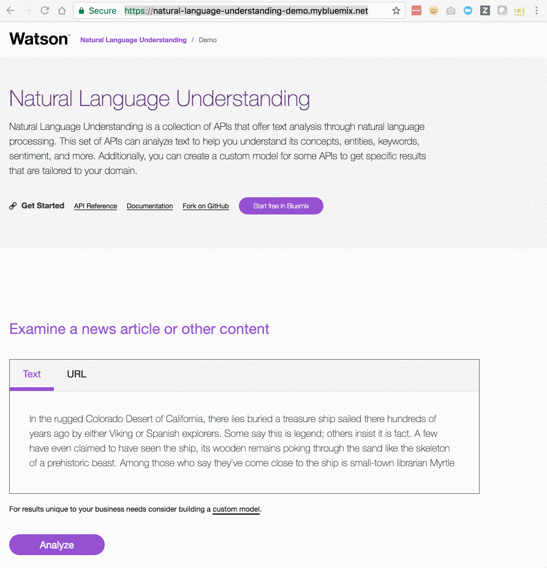

<h1 align="center" style="border-bottom: none;">🚀 Natural Language Understanding Sample Application</h1>
<h3 align="center">This Node.js app demonstrates some of the Natural Language Understanding service features.</h3>
<p align="center">
  <a href="http://travis-ci.org/watson-developer-cloud/natural-language-understanding-nodejs">
    
  </a>
  <a href="#badge">
    
  </a>
</p>
</p>

Natural Language Understanding is a collection of APIs that offer text analysis through natural language processing. This set of APIs can analyze text to help you understand its concepts, entities, keywords, sentiment, and more. Additionally, you can create a custom model for some APIs to get specific results that are tailored to your domain.

[](https://natural-language-understanding-demo.ng.bluemix.net)

## Prerequisites

1. Sign up for an [IBM Cloud account](https://cloud.ibm.com/registration).
1. Download the [IBM Cloud CLI](https://cloud.ibm.com/docs/cli?topic=cli-getting-started#overview).
1. Create an instance of the Natural Language Understanding service and get your credentials:
   - Go to the [Natural Language Understanding](https://cloud.ibm.com/catalog/services/natural-language-understanding) page in the IBM Cloud Catalog.
   - Log in to your IBM Cloud account.
   - Click **Create**.
   - Click **Show** to view the service credentials.
   - Copy the `apikey` value.
   - Copy the `url` value.

## Configuring the application

1. In the application folder, copy the _.env.example_ file and create a file called _.env_

   ```
   cp .env.example .env
   ```

2. Open the _.env_ file and add the service credentials that you obtained in the previous step.

   Example _.env_ file that configures the `apikey` and `url` for a Natural Language Understanding service instance hosted in the US East region:

   ```
   NATURAL_LANGUAGE_UNDERSTANDING_IAM_APIKEY=X4rbi8vwZmKpXfowaS3GAsA7vdy17Qh7km5D6EzKLHL2
   NATURAL_LANGUAGE_UNDERSTANDING_URL=https://gateway-wdc.watsonplatform.net/natural-language-understanding/api
   ```

## Running locally

1. Install the dependencies

   ```
   npm install
   ```

1. Run the application

   ```
   npm start
   ```

1. View the application in a browser at `localhost:3000`

## Deploying to IBM Cloud as a Cloud Foundry Application

1. Login to IBM Cloud with the [IBM Cloud CLI](https://cloud.ibm.com/docs/cli?topic=cli-getting-started#overview)

   ```
   ibmcloud login
   ```

1. Target a Cloud Foundry organization and space.

   ```
   ibmcloud target --cf
   ```

1. Edit the _manifest.yml_ file. Change the **name** field to something unique.  
   For example, `- name: my-app-name`.
1. Deploy the application

   ```
   ibmcloud app push
   ```

1. View the application online at the app URL.  
   For example: https://my-app-name.mybluemix.net

## Directory structure

```none
.
├── app.js                      // express routes
├── config                      // express configuration
│   ├── express.js
│   └── security.js
├── manifest.yml
├── package.json
├── public                      // static resources
├── server.js                   // entry point
├── test                        // tests
└── views                       // react components
```

## License

This sample code is licensed under Apache 2.0.  
Full license text is available in [LICENSE](LICENSE).

## Contributing

See [CONTRIBUTING](CONTRIBUTING.md).

## Open Source @ IBM

Find more open source projects on the
[IBM Github Page](http://ibm.github.io/).
